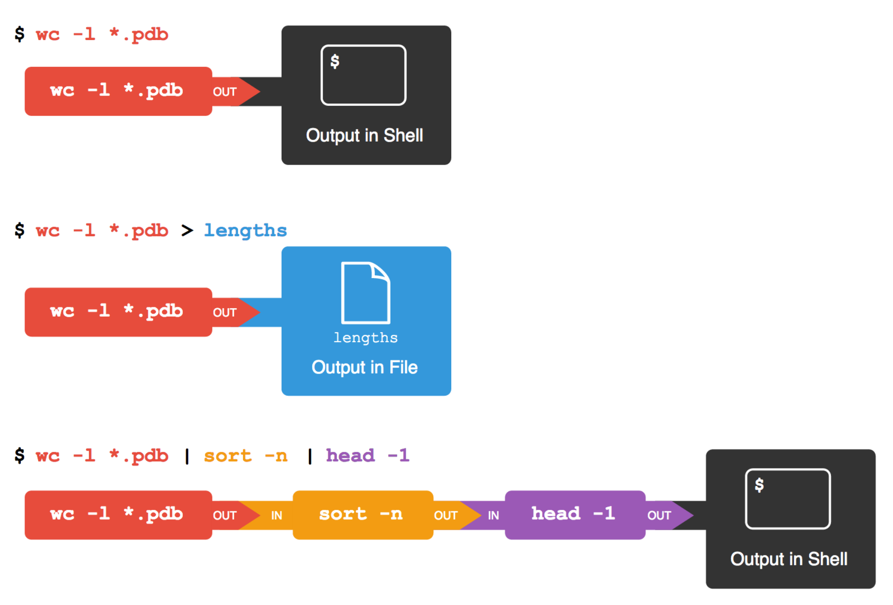
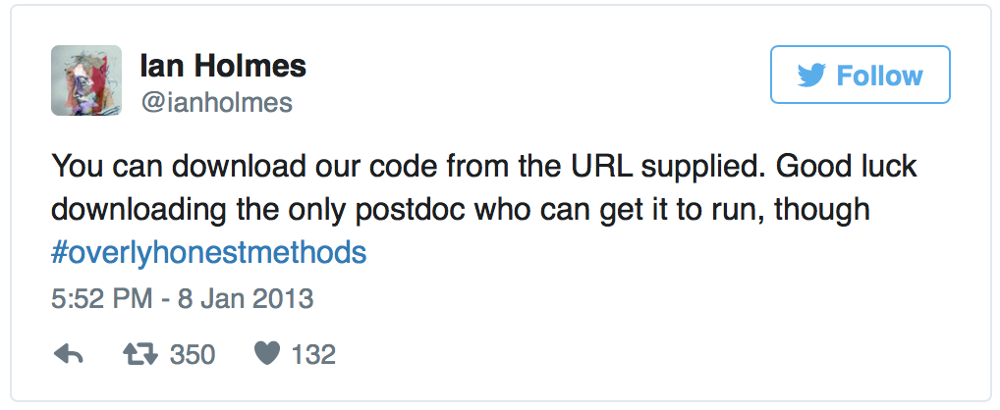
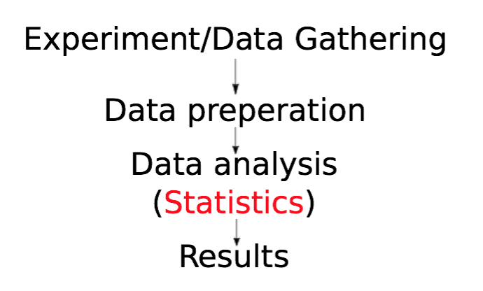
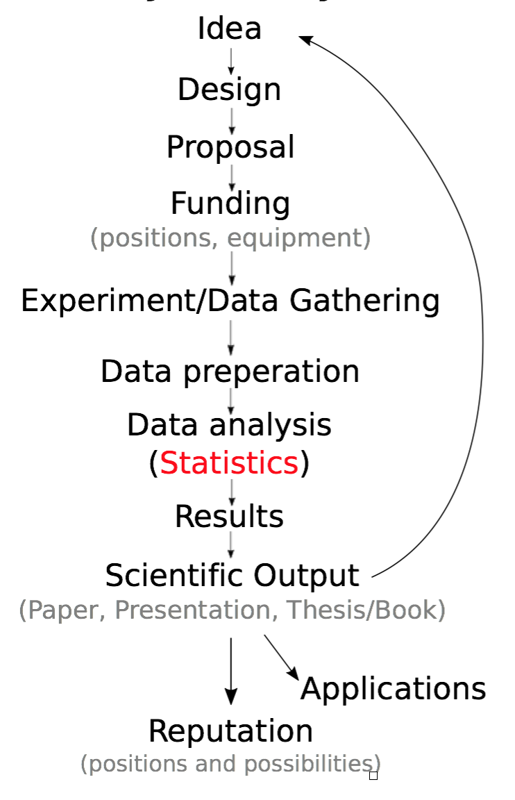
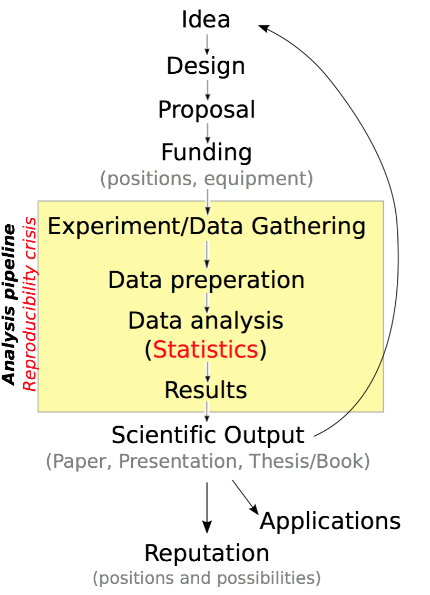
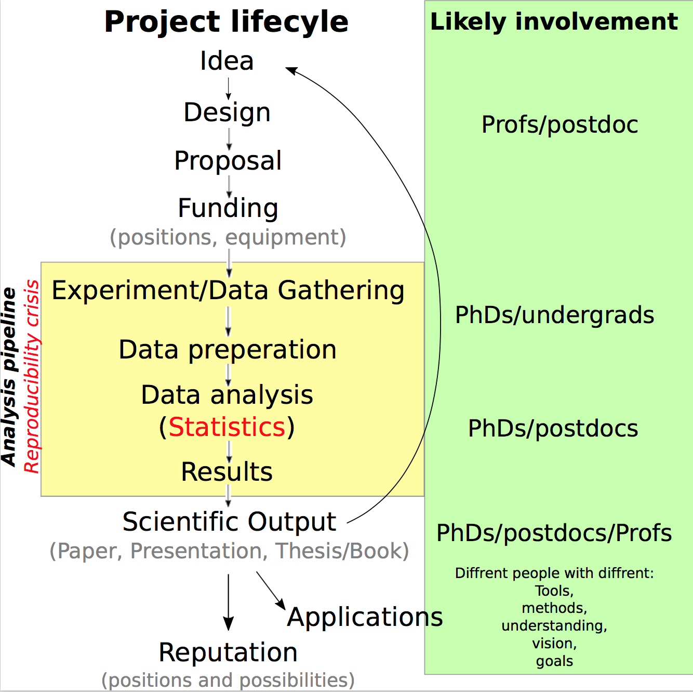
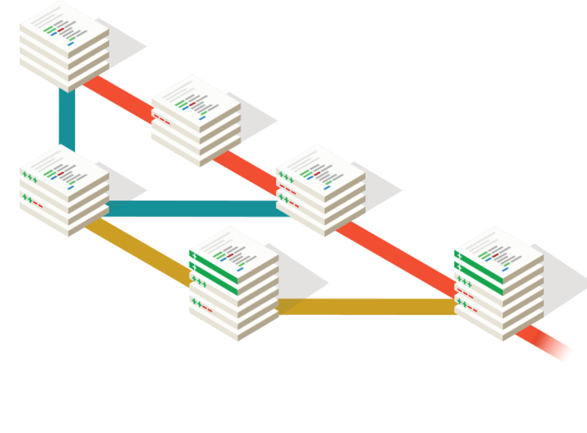

Bash, Python, Open Science & Stats
===================================

[@benlaken](https://twitter.com)

NATCLIMVAR, 20th October 2016, Bucharest

[Repo](http://bit.ly/2dY4qZi)

[Personal Website](http://www.benlaken.com)

https://public.etherpad-mozilla.org/p/NATVARCLIM

---

## My aims are to give you:


* Better understanding of what you can do with your computer <!-- .element class="fragment" -->

* Overview of where stats fit into Science, the "reproducibility crisis", and how it relates to you<!-- .element class="fragment"  -->

* A small peek inside the world of data science <!-- .element class="fragment" -->


---

### Command line interfaces<!-- .element class="fragment" -->

 <!-- .element style="width:50%;" -->

First mice & GUIs in early 1980's <!-- .element class="fragment" -->
. Before then, people need to do all same operations. <!-- .element class="fragment" -->

---

### File system structure

 <!-- .element style="width:80%;" -->

source [Software Carpentry](http://swcarpentry.github.io/shell-novice/)

--

### File system structure

 <!-- .element style="width:62%;" -->

source [Software Carpentry](http://swcarpentry.github.io/shell-novice/)

--


## BASH

 <!-- .element style="width:60%" -->

Irrelevant, geeky, and just for hackers?

--

### BASH ([Bourne Again SHell](https://en.wikipedia.org/wiki/Bash_(Unix_shell))

* High action to keystroke ratio, opposite to GUIs<!-- .element style="color: #FF0000;" -->
* Powerful model of small, connectable programs
* End up saving you much time
* But there are limits to its use...

Time to try it! Download the files from https://github.com/benlaken/Romania_2016
and place the folder on your Desktop.

--

###Our dataset

E.g. using Global Historical Climatology Network (GHCN) Data over Romania: [source NOAA](https://www.ncdc.noaa.gov/data-access/land-based-station-data/land-based-datasets/global-historical-climatology-network-ghcn)

 <!-- .element style="width:90%;" -->

--

### BASH

Anatomy of a Bash program

```bash
$program_name -optional_flags input_file(s)

$echo 'hello world!'
hello world!
```

By default, output comes to the screen. To redirect it you can use an arrow:

```bash
$echo 'hello world!' > new_textfile.txt
$cat new_textfile.txt
hello world!
```

The output of `echo` was sent to `new_textfile.txt`. After, I used the program `cat`
to display the contents of the file.

--

### BASH

<table style="width:100%">
  <tr>
    <th>Command</th>
    <th>Result</th>
  </tr>
  <tr>
    <td>whoami</td>
    <td>see the user you are logged in as</td>
  </tr>
  <tr>
    <td>pwd</td>
    <td>print where you are in filesystem</td>
  </tr>
  <tr>
    <td>cd</td>
    <td>change directory</td>
  </tr>
  <tr>
    <td>ls</td>
    <td>show whats in a location</td>
  </tr>
</table>

--

### BASH

<table style="width:100%">
<tr>
  <th>Command</th>
  <th>Result</th>
</tr>
<tr>
  <td>cat</td>
  <td>show contents of a file</td>
</tr>
<tr>
  <td>wc</td>
  <td>count lines, words, characters of a file</td>
</tr>
<tr>
  <td>echo</td>
  <td>send to standard output (print)</td>
</tr>
<tr>
  <td>mv</td>
  <td>move or rename a file or folder</td>
</tr>
<tr>
  <td>rm</td>
  <td>erase something</td>
</tr>
</table>

--

### BASH

If the Data folder is placed on desktop, navigate to it and see contents via:

```bash
$whoami
ben
$cd Desktop/Data/station_data
$pwd
~/Desktop/Data/station_data
$ls
BUM00015502_VIDIN_BU_.csv                 ROE00108888_BOTOSANI_RO_.csv              ROE00108901_SIBIU_RO_.csv
MD000033881_LEOVA_MD_.csv                 ROE00108889_BUCURESTI_BANEASA_RO_.csv     ROE00108903_TULCEA_RO_.csv
MD000033885_KAGUL_MD_.csv                 ROE00108890_CARANSEBES_RO_.csv            ROM00015023_STEFAN_CEL_MARE_RO_.csv
ROE00100829_ARAD_RO_.csv                  ROE00108891_CEAHLAU_TOACA_RO_.csv         ROM00015085_BISTRITA_RO_.csv
ROE00100898_BAIA_MARE_RO_.csv             ROE00108892_CONSTANTA_RO_.csv             ROM00015247_TRAIAN_VUIA_RO_.csv
ROE00100899_BUCURESTI_FILARET_RO_.csv     ROE00108893_CRAIOVA_RO_.csv               ROM00015280_VARFU_OMUL_RO_.csv
ROE00100900_BUZAU_RO_.csv                 ROE00108894_DEVA_RO_.csv                  ROM00015360_SULINA_.csv
ROE00100901_CALARASI_RO_.csv              ROE00108895_GALATI_RO_.csv                UPM00033657_SELIATYN_UP_.csv
ROE00100902_CLUJ_NAPOCA_RO_.csv           ROE00108896_IASI_RO_.csv                  UPM00033889_IZMAIL_UP_.csv
ROE00100903_DROBETA_TURNU_SEVERIN_RO_.csv ROE00108897_MIERCUREA_CIUC_RO_.csv        UPM00033898_VILKOVO_UP_.csv
ROE00100904_TG_JIU_RO_.csv                ROE00108898_OCNA_SUGATAG_RO_.csv          sorted.txt
ROE00100905_TURNU_MAGURELE_RO_.csv        ROE00108899_RAMNICU_VALCEA_RO_.csv        stats.sh
ROE00108887_BACAU_RO_.csv                 ROE00108900_ROSIORI_DE_VEDE_RO_.csv

```

--

### BASH

 <!-- .element style="width:75%" -->

source [Software Carpentry](http://swcarpentry.github.io/shell-novice/)

--

### BASH

`*.csv` matches all csv files in the folder. The `|` (pipe) makes output
from left-side program be input of the right-side program.

```bash
$pwd
~/Desktop/Data/station_data
$wc -l *.csv | sort -n | head -5
3000 UPM00033898_VILKOVO_UP_.csv
3289 MD000033885_KAGUL_MD_.csv
5019 MD000033881_LEOVA_MD_.csv
5560 BUM00015502_VIDIN_BU_.csv
7144 UPM00033657_SELIATYN_UP_.csv
```

--

<!-- .element data-background="http://i.giphy.com/90F8aUepslB84.gif" -->


---

## Open Science
What is it? Open discussion!

 <!-- .element style="width:80%; border:none" -->

--

## The role of Stats

1. Where do stats fit in the research lifecycle?
1. Who is typically involved (and when)?
1. How does this relate to
<span>the Reproducibility crisis <!-- .element style="color: #FF0000" --></span>
?
1. How can you use <span>Open Science <!-- .element style="color: #228B22" --></span>to make your work better?

--

### Scientific project lifecycle

 <!-- .element style="width:75%" -->

--

### Scientific project lifecycle

 <!-- .element style="width:35%" -->

--

### Scientific project lifecycle

 <!-- .element style="width:35%" -->

--

### Scientific project lifecycle

 <!-- .element style="width:55%" -->

--

### Academic archetypes: an anti-pattern for reproducibility?

 <!-- .element style="width:80%" -->

http://benlaken.com/blog/?id=27

--

### Your typical workflow?

```
└── my_project
    │
    ├── Code
    │   ├── process_raw_data.f77  <--- Heart of the project, written in FORTRAN by, uh, someone...
    │   └── calculate_result.m    <--- The postdoc who wrote this already left to work for a bank...
    │
    ├── Data
    │   ├── raw_experiment1.txt  <--- This is the raw data from my instrument
    │   ├── raw_experiment2.txt
    │   ├── raw_experiment3.txt
    │   └── processed_data.dat  <--- Postdocs code makes this output I can read into Excel
    │
    ├── output1.txt             <--- The postdocs code made this, which I can put into excel to examine...
    ├── experiment1.xlsx        <--- Finally, I can do something useful with this $*#@!
    ├── experiment2.xlsx
    ├── my_report_v3.docx       <--- The start of my thesis, or new paper
    └── summary_results.xlsx    <--- Summary excel sheet, so I can clean up my final results
```

--

###  Your typical workflow?

Danger signs<!-- .element style="color: #FF0000" -->
- Manual pipeline
- Inherited code you don't understand
- Monolithic spreadsheets
- Difficult to re-run/change something
- No documentation
- You never actually intended for anyone else to use the work...

--

### How can you start to change this?

Goal: people should be able to see what you did, and how you did it
<span>without effort on their part<!-- .element style="color: #228B22" --></span>

* Learn key tools (Bash, Python/R, Git)<!-- .element class="fragment" -->
* Pace yourself: improve incrementally<!-- .element class="fragment" -->
* Expect to share all your work, not just your final paper<!-- .element class="fragment" -->

http://benlaken.com/blog/?id=29<!-- .element class="fragment" -->

--

#### Do you live in version hell?

 <!-- .element style="width:50%; border:none" -->

--

### A quick word on Git

 <!-- .element style="width:40%; border:none" -->

* Industry-standard version-control system
* Protect, share, and maintain your code
* Collaborative tool: track complex changes to multiple files and multiple authors

[Codecademy](https://www.codecademy.com/learn/learn-git) is an easy way to start learning Git

--

<!-- .element data-background="imgs/bateman.gif" -->

---

### Python

<!-- .element style="width:50%; border:none" -->

---

### Conclusions

Better stats = Trustworthy stats<!-- .element style="font-size: 0.75em; color: #008000;" -->

Use and contribute to existing tools: don't re-write them or use black-boxes<!-- .element style="font-size: 0.75em;" -->

You may work on a narrow problem, but working with shared tools connects you to other communities<!-- .element style="font-size: 0.75em;" -->

Reproducibility is one of the main problems in Science today<!-- .element style="font-size: 0.75em;" -->
It is a systemic problem. And you are already part of that system.<!-- .element style="font-size: 0.75em; color: #FF0000" -->

> Be the change you wish to see in the world <!-- .element style="font-size: 0.75em;" -->

> --Mahatma Gandhi<!-- .element style="font-size: 0.75em;" -->

---

<!-- .element data-background="imgs/shelf.gif" -->

## **Thanks for listening, and good luck!** <!-- .element style="color: #FFFF; font-size: 1.0em;" -->

[@benlaken](https://twitter.com) <!-- .element style="color: #FFD700" -->
~ <!-- .element style="color: #FFD700" -->
[Web](http://www.benlaken.com) <!-- .element style="color: #FFD700" -->

October'16 - NATCLIMVAR - Bucharest
