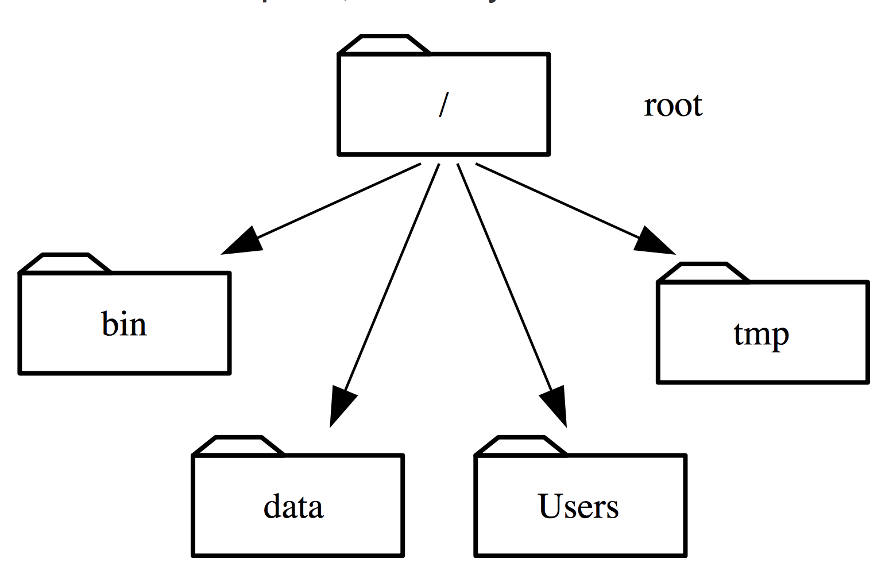
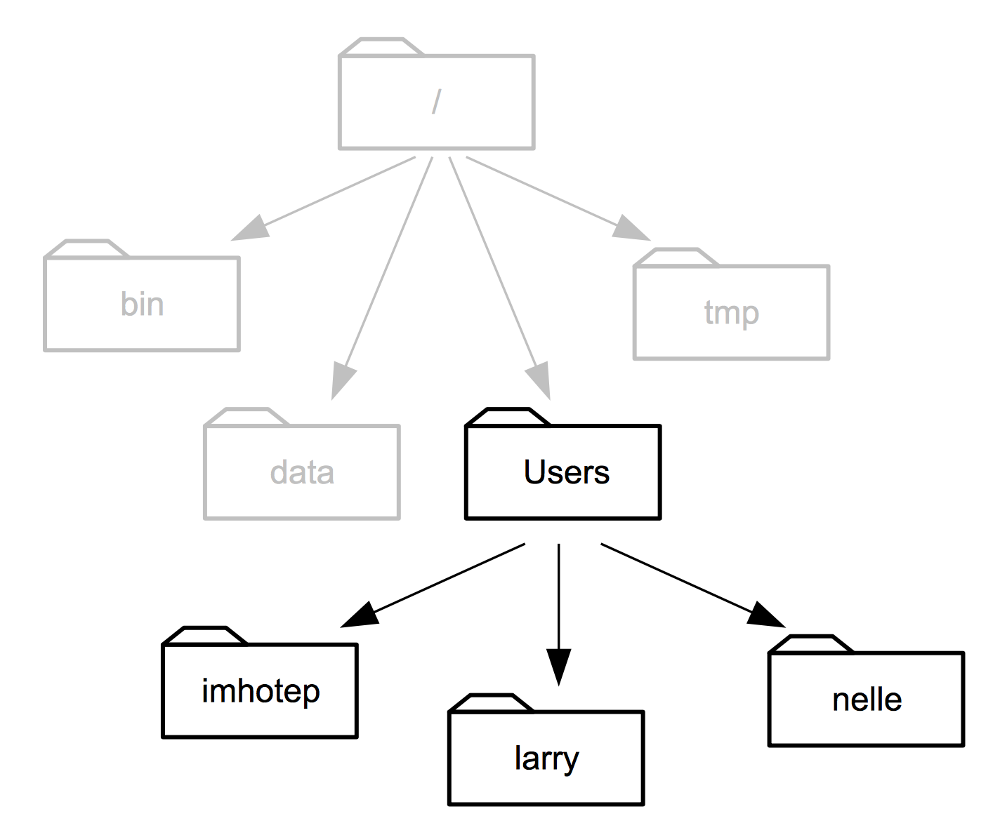
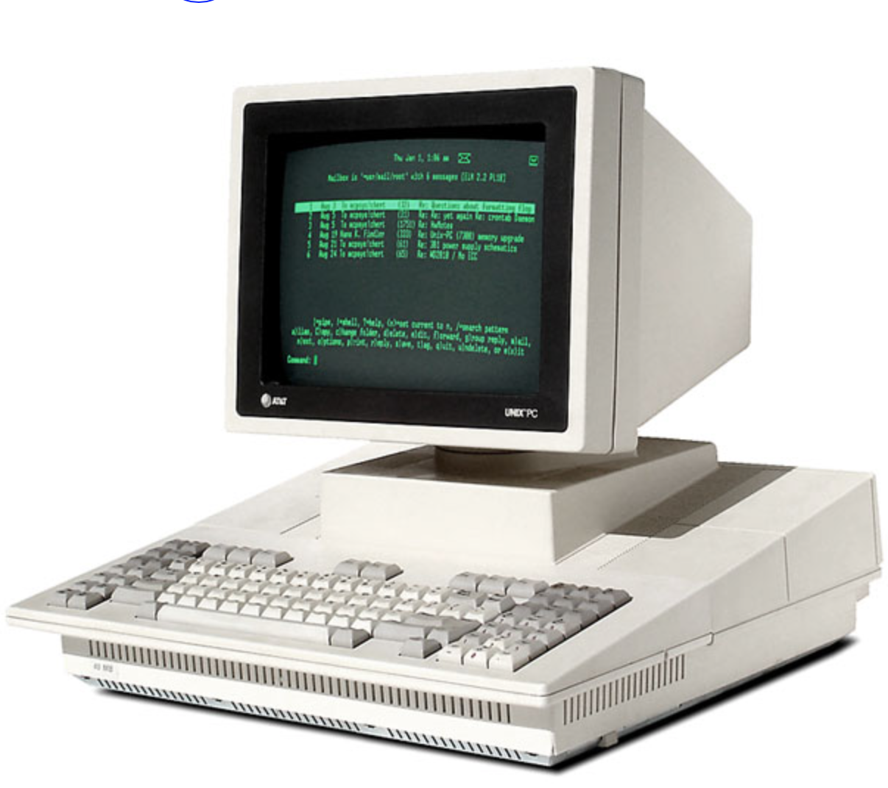

Bash, Python, Open Science & Stats
===================================

[@benlaken](https://twitter.com)

NATCLIMVAR, 20th October 2016, Bucharest

[Repo](http://bit.ly/2dY4qZi)

[Personal Website](http://www.benlaken.com)

https://public.etherpad-mozilla.org/p/NATVARCLIM
---

## My aims are to give you:


* Better understanding of what you can do with your computer <!-- .element class="fragment" -->

* Overview of where stats fit into Science, the "reproducibility crisis", and how it relates to you<!-- .element class="fragment"  -->

* A small peek inside the world of data science <!-- .element class="fragment" -->


---

### File system structure

 <!-- .element style="width:80%;" -->

source [Software Carpentry](http://swcarpentry.github.io/shell-novice/)
---

### File system structure

 <!-- .element style="width:62%;" -->

source [Software Carpentry](http://swcarpentry.github.io/shell-novice/)

---

### Command line interfaces

 <!-- .element style="width:50%;" -->

First computer mice/GUIs arrive in early 1980's <!-- .element class="fragment" -->

---

## BASH

 <!-- .element style="width:60%" -->

Irrelevant, geeky, and just for hackers?

---

## BASH

* High action to keystroke ratio, opposite to GUIs
* Powerful model of small, connectable programs

Time to try it! Download  e.g. data from https://github.com/benlaken/Romania_2016


---

## BASH

<table style="width:100%">
  <tr>
    <th>Command</th>
    <th>Result</th>
  </tr>
  <tr>
    <td>whoami</td>
    <td>see the user you are logged in as</td>
  </tr>
  <tr>
    <td>pwd</td>
    <td>print where you are in filesystem</td>
  </tr>
  <tr>
    <td>cd</td>
    <td>change directory</td>
  </tr>
  <tr>
    <td>ls</td>
    <td>show whats in a location</td>
  </tr>
  <tr>
    <td>cat</td>
    <td>show contents of a file</td>
  </tr>
  <tr>
    <td>wc</td>
    <td>count lines, words, characters of a file</td>
  </tr>
</table>

---

## BASH

Repeating actions in loops:

```bash
echo $PATH

```

---

Thanks!
===================================

Benjamin Laken · [@benlaken](https://twitter.com)

October'16 - NATCLIMVAR - Bucharest

*I am available for project consultancy*

[Repo](http://bit.ly/2dY4qZi)

[Personal Website](http://www.benlaken.com)


<!--
RESOURCES

COLORS:

Location Red
#F24440
#FF918F

Navy Blue
#162945

Purple
#C6ACFC
#C6ACFC

Prediction Blue
#1785FB

Green
#73C86B


-->
